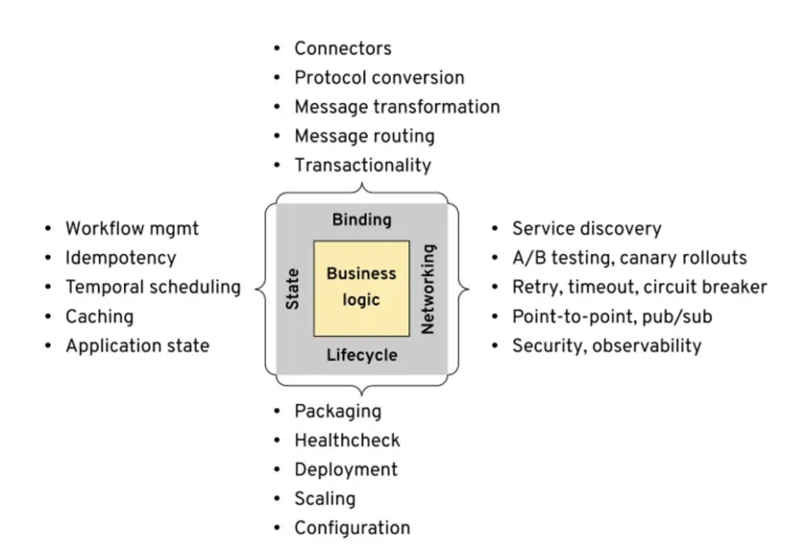

## 为什么没有使用传统的微服务框架

1. 没有一种现有的微服务框架比较完美的支持多语言 (开源 or 自研)
2. 对于 go 自身来说，没有像 java 一样有 spring cloud 和 dubbo 的微服务生态
3. 没有历史负担，可以选择新技术
4. 新技术也是云原生领域我们需要研究与产品话的，有很大实践意义

## what is dapr (Distributed Application runtime)

dpar是为应用提供分布式能力的运行时

### 怎么理解 runtime？

通常我们会将 `runtime` 当成程序正常运行的支持(库，命令，执行环境等等)

我们平常用到的一些 runtime:
* go runtime: 垃圾回收，内存管理，与操作系统交互等等
* java虚拟机: 编译.class字节码等等
* low level container runtime: runc, kata等等，提供容器的统一操作接口

* runtime 生命周期通常与用户程序一致
* runtime 为用户程序提供一些功能，通常不由程序编写者提供

分布式部分，通常的分布式应用能力

* 服务间通信，包含重试限流等
* 数据持久化
* 消息订阅/发布
* 分布式事务 (最终一致性 or 强一致性)
* tracing
* ...

在传统的分布式应用中，这些都是集成在程序里的，需要作为一部分业务逻辑去实现。

dapr 将上述的分布式应用能力独立做成一个 runtime。以 sidecar 的形式与用户应用程序共生命周期

### what is multi runtime

[multi runtime microservice arch](https://www.infoq.com/articles/multi-runtime-microservice-architecture/)

分布式应用的需求:

* 生命周期： 部署，健康检查，HPA, 配置管理等
* 网络: 流量治理，失败重试，限流，消息订阅/发布等
* 状态: 数据读写，幂等，分布式事务等
* 绑定: 与外部资源的交互等

以前这些均由程序开发者自己完成或框架提供能力

现在的方向, 部分能力交由基于k8s的基础设施来实现

未来发展的方向

业务逻辑之外的东西由各种运行时提供，需要什么能力，就与提供能力的运行时一起部署

dapr 就是将除业务逻辑之外的开发所需的运行时能力做了整合

## Dapr arch and different between Mesh

mesh 是从基础设施的角度触发, dapr 是从开发者的角度出发